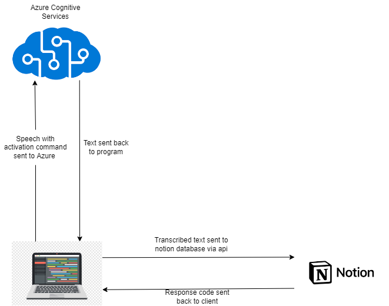
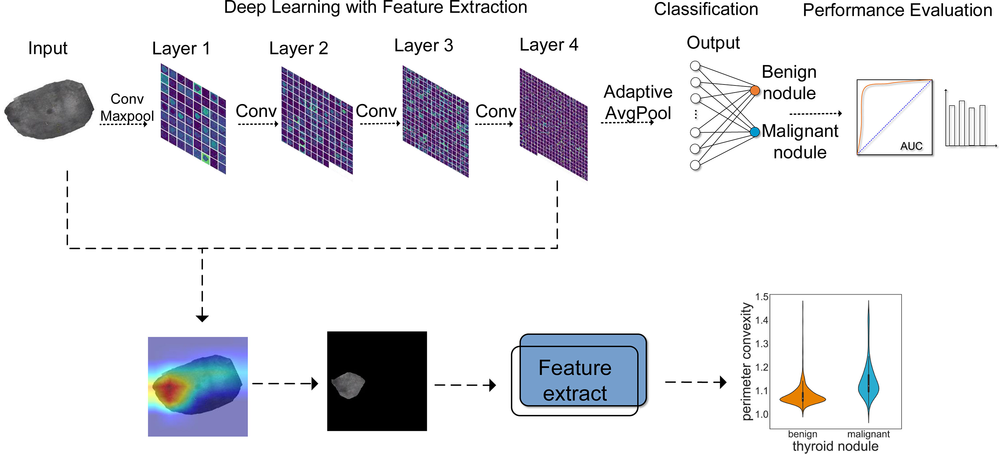

# Speech Recognition with Azure Cognitive Services
----------

## Project description
This project is a simple speech recognition application that uses Azure Cognitive Services to convert speech to text and save the text to a Notion Databse. The application is built using the Python, the Azure Speech SDK and NOTION API. 

## You'll need
- Python 3.8
- Azure Cognitive Services
- Notion API
- Streamlit

## How to use
1. Clone the repository
2. Create a Notion Database and get the database ID
3. Create a Notion API key and get the API key
4. Create an Azure Cognitive Services resource and get the API key
5. Create a .env file and add the following variables
    - NOTION_DATABASE_ID
    - NOTION_API_KEY
    - AZURE_SPEECH_KEY
    - AZURE_SPEECH_REGION
6. Run the application

# Malignant & Benign Image Classification with a Deep Neural Network
----------

## Project description
This project demonstrates image classification using Deep Neural Networks. The tackle of the classification is medical imaging, where the classifier can be used to identify certain features in medical images (e.g. malignant vs. benign tumors)

## You'll need
- Python 3.9
- Dependancies that are specified on the .yml file
- Dataset [Malignant VS Benign](https://www.kaggle.com/datasets/fanconic/skin-cancer-malignant-vs-benign)

## How to use
1. Clone the repository
2. Download the image dataset from the Kaggle link
3. Run the Malignang_Benign_DNN.ipynb file
4. Open the link from the gradio user interface
